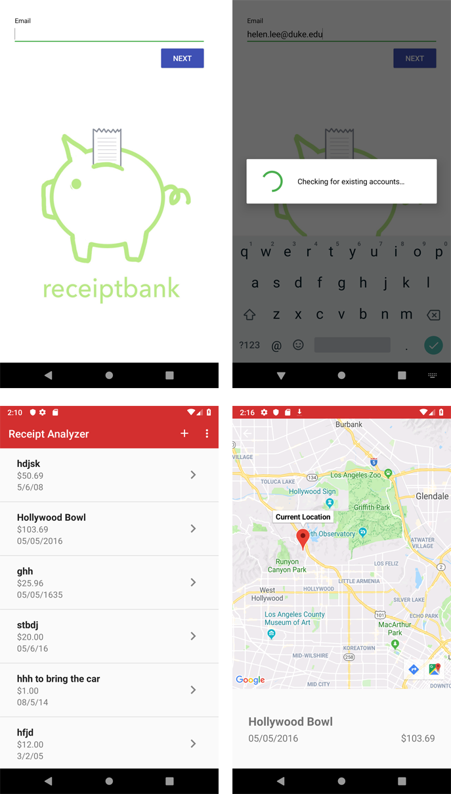

# Receipt Analyzer App
This Android application was built for Duke's CS290.3 Mobile Software Development course. 
The original website for this project is available [HERE](https://joycechoi19.github.io/receiptAnalyzerWebsite/). 

[This link](https://hjools.github.io/receiptAnalyzerApp/) leads back to the current project page.

The app aims to do 2 things:
1. Make your paper receipts electronic by simply taking a photo and storing all of them in a easy to navigate UI 
2. Use image-to-text conversion to make receipts searchable by store name, purchase date, or amount spent

## Technologies Used
* Android Studio & Java
* Firebase
* Google Cloud Vision OCR
* Google Maps API

